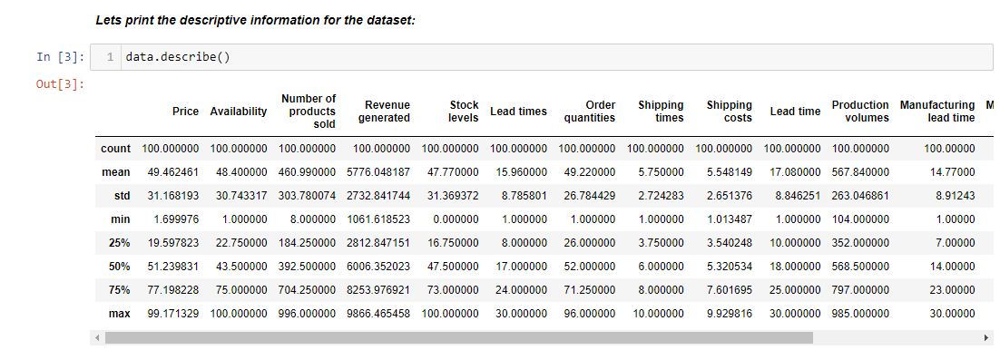
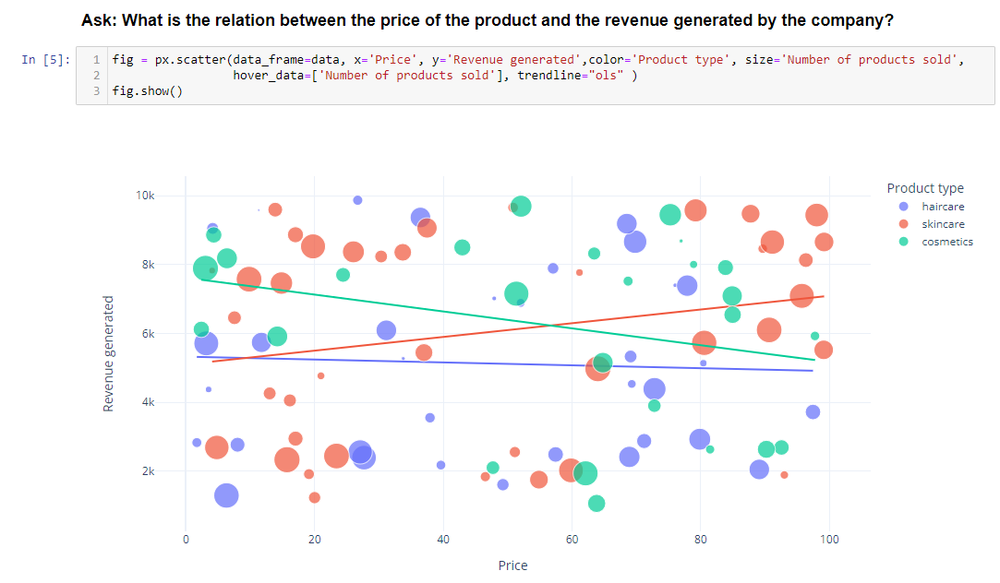
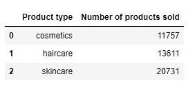
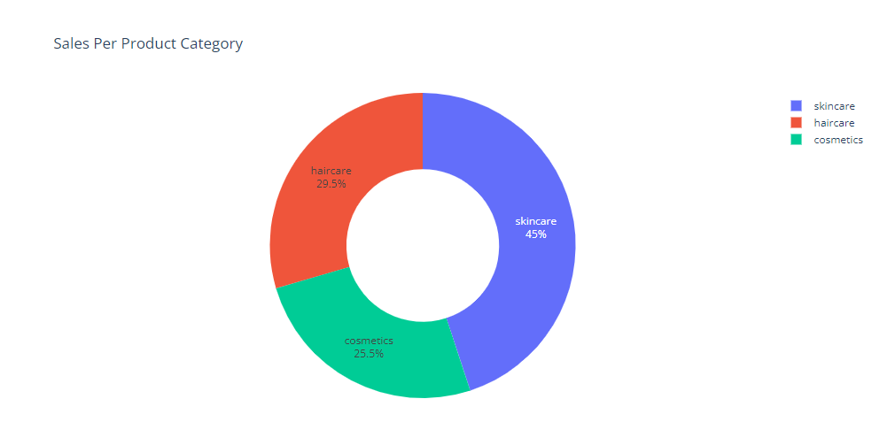
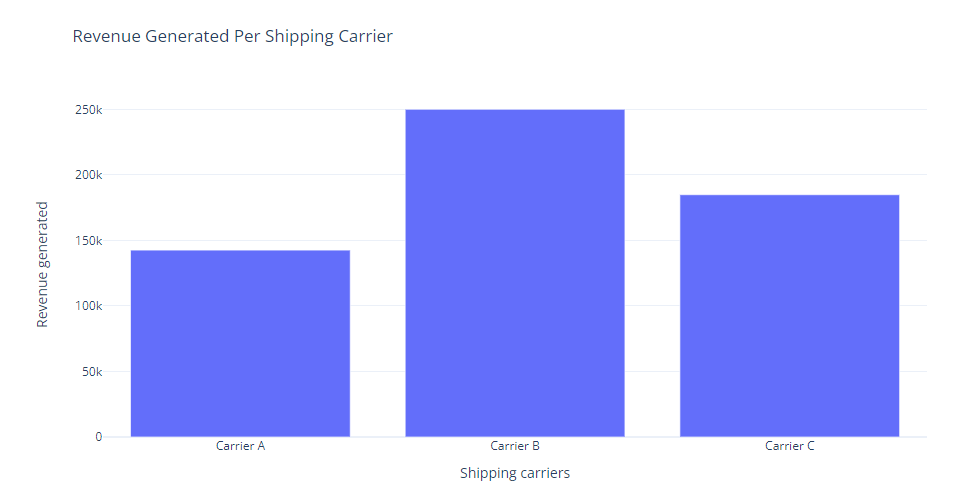
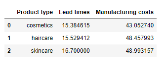
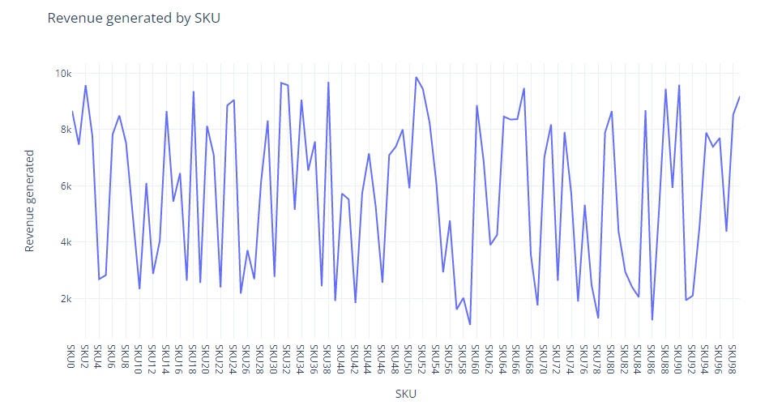

# Supply chain analysis with Python
 

## Goal Of The Project:
Analyze the supply chain data of a Fashion and Beauty Startup and find the patterns to show the relationships between different factors.
 
 
Data has been used from the site: 
<a href='https://statso.io/supply-chain-analysis-case-study/'>Data Souce</a>
 

<h3> 1. Let's see the descriptive information of the dataset. </h3>
 
 

<h3>2. The relation between the price and the revenue generated by the company per the product category. </h3>
 
 

In the chart, we can see that the company makes more profit by selling the skincare products. 

 As we can see there are 3 categories that the company are selling, let's see how many products are sold in each of the category. 

<h3> 3. How many Products are sold in each of these categories? </h3>

 
 

 Let's have a view as a pie-chart. 

45 % of the sold products belong to the skincare category, while 29.5 % belong to the haircare and 25.5 % belong to the cosmetics product. This chart clearly shows the indication of why skincare category is the most profitable one. 

 
<h3>4. What is the total revenue generated by different shipping carriers?</h3>

Here, the Carrier-B is driving more revenue compared to the other shipping carriers.

<h3>Now let's see the average lead time and the average production cost of each of the product category:</h3>

 
<b>
Now, let's analyze the SKU (Stock keeping Units). These are the unique numbers given to identify the products </b>

 
<h3>Analyzing revenue generated by each SKU:</h3>
