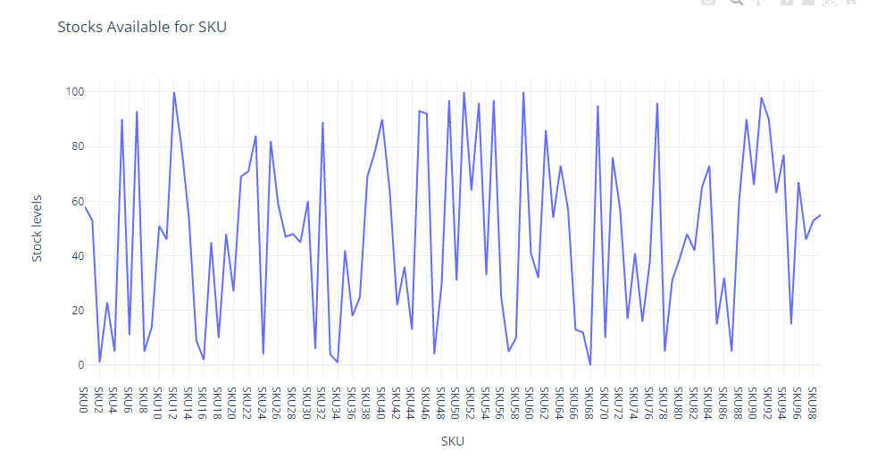
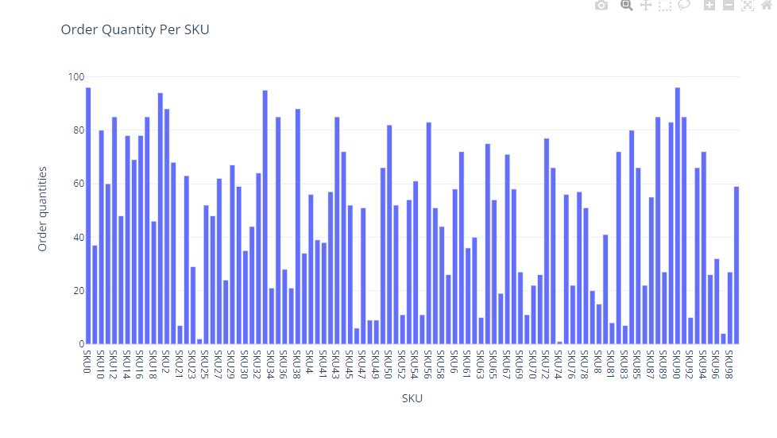
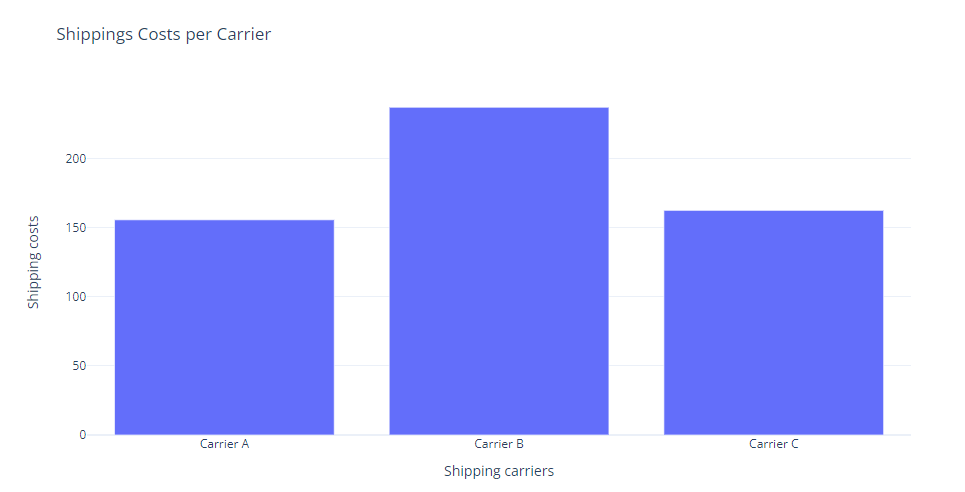
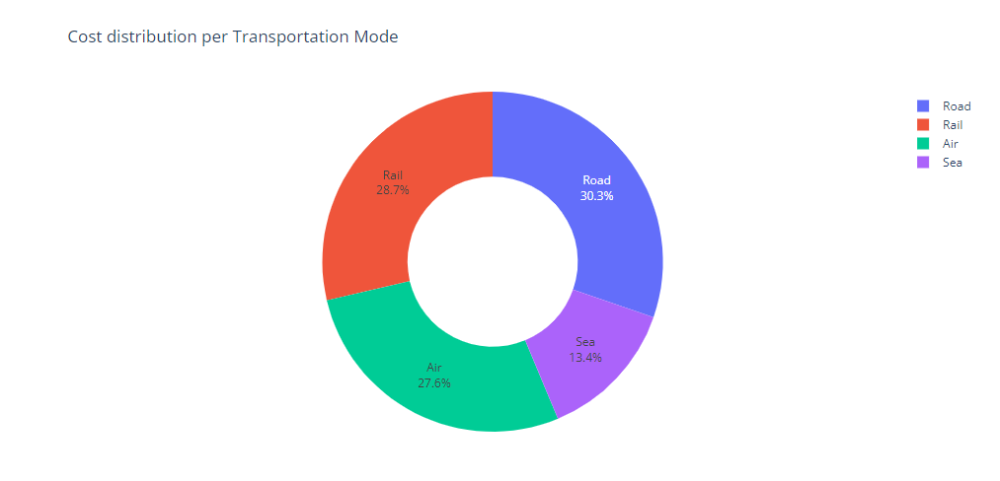
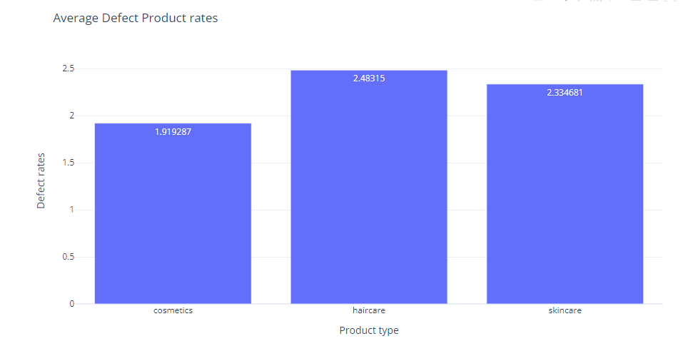
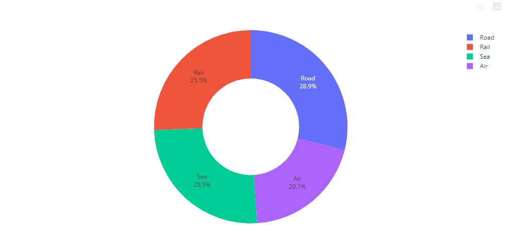

# Supply chain analysis with Python
 

## Goal Of The Project:
Analyze the supply chain data of a Fashion and Beauty Startup and find the patterns to show the relationships between different factors.
 
 
Data has been used from the site: 
<a href='https://statso.io/supply-chain-analysis-case-study/'>Data Souce</a>
 

<h3> 1. Let's see the descriptive information of the dataset. </h3>
 
 

<h3>2. The relation between the price and the revenue generated by the company per the product category. </h3>
 
 

In the chart, we can see that the company makes more profit by selling the skincare products. 

 As we can see there are 3 categories that the company are selling, let's see how many products are sold in each of the category. 

<h3> 3. How many Products are sold in each of these categories? </h3>

 
 

 Let's have a view as a pie-chart. 

45 % of the sold products belong to the skincare category, while 29.5 % belong to the haircare and 25.5 % belong to the cosmetics product. This chart clearly shows the indication of why skincare category is the most profitable one. 

 
<h3>4. What is the total revenue generated by different shipping carriers?</h3>

Here, the Carrier-B is driving more revenue compared to the other shipping carriers.

<h3>5. Now let's see the average lead time and the average production cost of each of the product category:</h3>

 
<b>
Now, let's analyze the SKU (Stock keeping Units). These are the unique numbers given to identify the products </b>

 
<h3>6. Analyzing revenue generated by each SKU:</h3>

 
<h3>7. Now, let's see the number of stocks available for each SKU. </h3>

 
<h3>7. Let's visualize the order quantity of different SKU. </h3>

 

Earlier, we visualized which carrier was generaating the most revenue, now let's visualize the shipping costs for each of these carriers. 

<h3>8. Shipping cost for each of the carriers. </h3>

Although, Carrier-B was generating the most of the profit, we can see it also has the highest shipping cost compared to the rest of the avilable shipping methods. 

 
<h3>9.Now, let's see what are the transporation methods that the company is using. </h3>

 
<b>The two most invested transportation mode are Road with 30.3 % and Rail with 28.7 %.</b>

As, we also products which have defects, let's visualize
which products are the one with the highest defect counts and out of the available transportation modes, which of these are damaging the products the most or which of them is unsafest one.

<h3>10. Products with the highest defect counts.</h3>

 

As we can see, haircare product has the highest defect rate. Now, let's see which transportation mode leads to the product being delivered as the most defect one.

<h3>11. Transportation method with the highest defect counts .</h3>

 
<b>Here, we can see that products transported via Road has the highest defect rate with 28.9 %, while Rail and Sea in the same position with 25.5 % and Air being the least one with 20.1 %. </b>